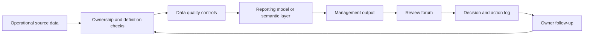

# Decision Support Architecture Playbook

## Project purpose

This repository is a documentation-led architecture playbook for designing controlled reporting and decision-support systems. It shows how fragmented manual reporting can be moved toward a clearer operating model with defined data ownership, KPI definitions, data-quality controls, review routines, implementation stages, and handover material.

The playbook is intended to demonstrate architecture and solution-design thinking rather than a single technical build.

## Business problem

Many teams rely on a mix of spreadsheets, manual extracts, dashboard pages, email updates, and informal KPI definitions. Reports may be produced regularly, but the route from source data to management decision is often unclear.

Common symptoms include:

- no agreed source-to-output map;
- KPI definitions that change by meeting or report owner;
- manual checks that depend on individual knowledge;
- weak evidence of data quality before reporting;
- dashboards that show numbers without ownership or caveats;
- review forums that discuss outputs without a reliable action loop;
- handover material that is incomplete when people move roles.

This playbook defines the architecture concepts needed to make reporting more controlled, explainable, and usable for decision support.

## Intended reader

Primary readers:

- analytics engineers who need to connect data models to reporting operations;
- reporting architects designing repeatable management information flows;
- data architects defining ownership, controls, and source-to-output structure;
- solution architects shaping reporting systems around business processes;
- decision-support leads who need outputs that can be reviewed, challenged, and handed over.

Secondary readers:

- hiring reviewers looking for evidence of structured architecture thinking;
- managers who need to understand what a controlled reporting system requires beyond dashboard visuals.

## What this project demonstrates

- Source-to-output architecture thinking.
- Requirements-to-reporting translation.
- KPI ownership and definition design.
- Data quality control placement.
- Reporting lifecycle and review-routine design.
- Operating-model and handover planning.
- Risk-based implementation sequencing.
- Practical documentation for stakeholder review.

## Architecture concept

Decision-support control loop:

The core idea is that a reporting system is not only a dashboard or dataset. It also needs definitions, control points, ownership, review cadence, and a way to turn findings into actions.

## Boundaries

In scope:

- architecture problem framing;
- current-state and target-state reporting patterns;
- source-to-output mapping;
- KPI dictionary structure;
- data quality control design;
- operating model;
- implementation roadmap;
- handover pack;
- reusable architecture templates.

Out of scope:

- claims of delivery for a real client or employer;
- protected, official, internal, or copied workplace material;
- a production platform deployment;
- a full enterprise architecture repository;
- a Power BI report build;
- a Python validation engine;
- a dbt analytics mart.

This repo should complement the other portfolio repositories, not duplicate them. It explains the operating model around decision support; the other repos demonstrate specific technical layers.

## Data and sample-data provenance

This is a documentation-led repo. Any examples must use generic, synthetic, non-client data structures and templates only. No real client names, employer material, official data, or internal workplace examples should be introduced.

## How to use this repository

Read the numbered documents in order:

1. Problem statement.
2. Current state.
3. Target state.
4. Source-to-output map.
5. Data quality controls.
6. KPI dictionary.
7. Operating model.
8. Implementation roadmap.
9. Risks and limitations.
10. Handover pack.

The templates folder contains reusable document structures that can support discovery, KPI definition, quality-rule design, requirements capture, and stakeholder review.

## Outputs

Current repository outputs:

- problem statement for fragmented manual reporting;
- current-state reporting flow and risk summary;
- target-state source-to-output architecture;
- data-quality control catalogue and escalation model;
- KPI dictionary structure with safe synthetic examples;
- operating model covering owners, cadence, quality responsibilities, escalation, change control, and handover;
- implementation roadmap with staged delivery gates;
- handover pack structure;
- reusable templates for KPI definitions, reporting requirements, quality rules, and review meetings;
- Mermaid diagrams for current state, source-to-output flow, reporting lifecycle, and assurance control loop;
- non-client walkthrough showing how the playbook could be applied to a manual reporting process.

## Commercial relevance

This repo supports decision-support, reporting architecture, data architecture, analytics engineering, and solution architecture roles by showing how technical reporting work fits into a wider system of ownership, controls, review routines, and handover.

It is designed to show that credible reporting architecture is not just about producing charts. It is about making sure the right data, definitions, checks, people, and decisions connect reliably.

## Limitations

- This is a portfolio playbook, not evidence of a live client engagement.
- It is not a substitute for organisation-specific discovery.
- It does not include real operational data or internal reporting documents.
- It does not implement a working reporting platform.
- It provides a reusable architecture pattern rather than a production implementation.
- The examples are synthetic and should be adapted before use in any real organisation.

## Next improvements

1. Preview Mermaid diagrams in GitHub to confirm layout readability.
2. Add an architecture decision record template if future changes need formal design decisions.
3. Add one compact example source-to-output map using the existing synthetic walkthrough.
4. Keep the public-readiness audit current whenever major docs change.
