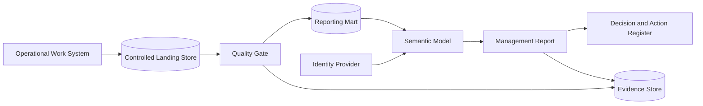

# Operations Review Service Architecture

[](https://github.com/quantameridian/decision-support-architecture-playbook/actions/workflows/ci.yml)
[](https://github.com/quantameridian/decision-support-architecture-playbook/actions/workflows/codeql.yml)
[](https://scorecard.dev/viewer/?uri=github.com/quantameridian/decision-support-architecture-playbook)
[](LICENSE)

This repository contains the proposed architecture and operating controls for a synthetic monthly operations review service. The service turns operational work records into governed workload, SLA and data readiness reporting, then preserves the decisions and actions taken in review.

The design is technology neutral where a product choice is not needed. It defines business outcomes, measurable service requirements, components, interfaces, controls, evidence, risks and architecture decisions. Those objects are held in one [architecture catalogue](catalogue/architecture.yaml) and checked for traceability in CI.

## Decision Supported

The Director of Operations needs to decide where intervention is required, which overdue work takes priority and whether the evidence is reliable enough for formal review. The service must publish by 09:00 on the third working day and disclose material quality limitations rather than hiding them behind a successful refresh.

The June 2026 synthetic cycle gives the proposed design something specific to resolve:

| Signal | Result | Decision implication |
| --- | ---: | --- |
| Current backlog | 16 | The unresolved queue needs active prioritisation |
| Overdue active items | 14 | Timeliness risk requires named owner action |
| SLA met rate | 69.2% | Performance is below the weighted target of 82.1% |
| Data readiness rate | 78.1% | Seven records require correction or an accepted caveat |

The filled [pilot release evidence](examples/pilot-release-evidence.md) shows how that cycle would be approved and carried into an action register.

## Proposed Service


```mermaid
flowchart LR
    Source["Operational Work System"] --> Landing[("Controlled Landing Store")]
    Landing --> Gate["Quality Gate"]
    Gate --> Mart[("Reporting Mart")]
    Mart --> Model["Semantic Model"]
    Identity["Identity Provider"] --> Model
    Model --> Report["Management Report"]
    Report --> Review["Decision and Action Register"]
    Gate --> Evidence[("Evidence Store")]
    Report --> Evidence
```

The design separates source receipt, quality judgement, reporting data, governed measures and consumption. This makes failures easier to isolate and prevents technical refresh success from being treated as proof that a report is ready.

## Architecture Evidence

| Concern | Reviewable evidence |
| --- | --- |
| Context and outcomes | [Executive brief](docs/00-executive-brief.md) and [problem statement](docs/01-problem-statement.md) |
| Requirements and traceability | [Requirements and traceability](docs/12-requirements-and-traceability.md) and the generated [validation evidence](docs/validation-report.md) |
| System structure | [Target state](docs/03-target-state.md), [system context](diagrams/system-context.mmd) and [container view](diagrams/container-view.mmd) |
| Interfaces and lineage | [Source to output map](docs/04-source-to-output-map.md) and catalogue interfaces `INT-01` to `INT-09` |
| Quality and release control | [Data quality controls](docs/05-data-quality-controls.md) and [ADR-001](decisions/ADR-001-reporting-readiness-gate.md) |
| KPI semantics | [KPI dictionary](docs/06-kpi-dictionary.md) |
| Ownership and operation | [Operating model](docs/07-operating-model.md), [roadmap](docs/08-implementation-roadmap.md) and [handover](docs/10-handover-pack.md) |
| Security and privacy | [Security architecture](docs/11-security-architecture.md), [trust boundaries](diagrams/trust-boundaries.mmd) and [ADR-003](decisions/ADR-003-semantic-model-access.md) |
| Risk and assurance | [Risk register](docs/09-risks-and-limitations.md) and [assurance review](examples/architecture-assurance-review.md) |
| Decision history | [Decision log](decisions/README.md) |

For a short review, use the [reviewer guide](docs/reviewer-guide.md).

## Measurable Commitments

The proposed service has eleven requirements. The main non functional commitments are:

- source freshness no worse than 24 hours at the agreed cut off;
- recovery inside eight business hours, with no more than 24 hours of accepted data loss;
- detailed records restricted by service area, with no detail for unmapped identities;
- reporting cycle evidence retained for 13 months;
- executive summary rendered inside five seconds at the agreed pilot volume;
- no special category data or direct personal contact details in the reporting model;
- applicable report interactions meet WCAG 2.2 AA with an equivalent tabular route;
- material stage failures reach the accountable owner within 15 minutes.

Each commitment has an owner, acceptance statement, control and evidence record in the catalogue. The validation report provides the generated coverage matrix.

## Run The Checks

Python 3.11 or later and Node.js 20 or later are required.

```bash
make install
make qa
```

The checks parse the YAML catalogue, verify every cross reference, check requirement coverage, inspect public content and local links, parse every Mermaid file with Mermaid itself, run unit tests and regenerate the traceability evidence. CI fails if the generated report is stale.

## Repository Map

```text
catalogue/     Architecture objects and traceability source
decisions/     Accepted scenario decisions and lifecycle index
diagrams/      Context, component, trust and process views as Mermaid
docs/          Business, architecture, control and operating records
examples/      Filled synthetic assurance and release evidence
templates/     Reusable requirements, control, decision and review records
scripts/       Catalogue, document and Mermaid validation
tests/         Regression tests for traceability failures
```

## Design Boundary

This is a proposed architecture for a synthetic case. It does not claim a live platform, production traffic, tenant configuration, user research, penetration test, cost estimate or regulatory approval. Recovery and performance targets are defined but not proven on a selected platform. The [assurance review](examples/architecture-assurance-review.md) therefore permits only a controlled pilot and records the evidence required before production approval.

## Reference Basis

The documentation approach follows the [C4 model](https://c4model.com/) for scoped architecture views and [GDS guidance](https://gds-way.digital.cabinet-office.gov.uk/standards/architecture-decisions.html) for decisions kept with version controlled service records. The decision lifecycle also reflects [AWS ADR guidance](https://docs.aws.amazon.com/prescriptive-guidance/latest/architectural-decision-records/adr-process.html).

Security analysis uses the NCSC sequence of [establishing context, resisting compromise and disruption, improving detection and reducing impact](https://www.ncsc.gov.uk/collection/cyber-security-design-principles). Operational review considers the security, reliability, performance and operations concerns described by the [Google Cloud Well Architected Framework](https://docs.cloud.google.com/architecture/framework), without implying that Google Cloud has been selected. Accessibility uses the [W3C WCAG 2.2 standard](https://www.w3.org/WAI/standards-guidelines/wcag/). Open standards, privacy and sustainability questions are informed by the [Technology Code of Practice](https://www.gov.uk/guidance/the-technology-code-of-practice), while monitoring and incident readiness draw on the [Azure operational excellence checklist](https://learn.microsoft.com/en-us/azure/well-architected/operational-excellence/checklist).
