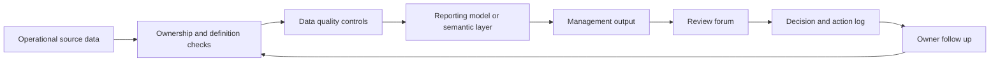

# Decision Support Architecture Playbook

[](https://github.com/quantameridian/decision-support-architecture-playbook/actions/workflows/ci.yml)
[](https://github.com/quantameridian/decision-support-architecture-playbook/actions/workflows/codeql.yml)
[](https://scorecard.dev/viewer/?uri=github.com/quantameridian/decision-support-architecture-playbook)
[](LICENSE)

## Project purpose

This repository is a public portfolio example of architecture work for controlled reporting and decision support. It shows how a messy manual reporting process can move toward clearer ownership, agreed KPI definitions, data quality checks, review routines, delivery stages, and handover material.

It is not a single technical build. It is meant to show architecture and solution design thinking around the work that sits beside the technical repos.

## Portfolio focus

This repo is designed to show how I structure a reporting problem before tools are chosen. It is the architecture companion to the Python, dbt, and Power BI repos: it explains the ownership, controls, review routine, risks, and handover path that make technical work useful in a business setting.

A hiring or technical reviewer should be able to see how a vague reporting problem becomes a structure that can be discussed, challenged, and delivered. The playbook moves from current state to target state, source to output mapping, controls, operating model, security boundaries, and handover. It also includes a short ADR example so the tradeoffs are visible instead of buried in prose.

What this does not claim: this is not a production platform, a client delivery pack, or evidence of a live enterprise implementation. It is a reusable architecture pattern with synthetic examples.

## Reviewer quick path

If you only have a few minutes, start here:

1. Read [docs/reviewer-guide.md](docs/reviewer-guide.md).
2. Read [docs/00-executive-brief.md](docs/00-executive-brief.md).
3. Inspect [docs/04-source-to-output-map.md](docs/04-source-to-output-map.md) and [docs/07-operating-model.md](docs/07-operating-model.md).
4. Read [docs/11-security-architecture.md](docs/11-security-architecture.md) for classification, access, and public and private boundaries.
5. Review [examples/manual-reporting-transformation-example.md](examples/manual-reporting-transformation-example.md) and [examples/architecture-decision-record-example.md](examples/architecture-decision-record-example.md) for applied synthetic examples.
6. Check [diagrams/README.md](diagrams/README.md) for the diagram inventory.
7. Run `make qa` to validate required docs, diagrams, templates, examples, and local links.

Important limitation: this is an architecture artifact, not a production implementation. It makes most sense when reviewed alongside the Python data quality repo, dbt service mart, and Power BI semantic model repo.

## Business problem

Many teams rely on a mix of spreadsheets, manual extracts, dashboard pages, email updates, and informal KPI definitions. Reports may be produced regularly, but the route from source data to management decision is often unclear.

Common symptoms include:

- no agreed source to output map;
- KPI definitions that change by meeting or report owner;
- manual checks that depend on individual knowledge;
- weak evidence of data quality before reporting;
- dashboards that show numbers without ownership or caveats;
- review forums that discuss outputs without a reliable action loop;
- handover material that is incomplete when people move roles.

This playbook lays out the architecture work needed to make reporting easier to explain, control, and use in a decision meeting.

## Intended reader

Primary readers:

- analytics engineers who need to connect data models to reporting operations;
- reporting architects designing repeatable management information flows;
- data architects defining ownership, controls, and source to output structure;
- solution architects shaping reporting systems around business processes;
- decision support leads who need outputs that can be reviewed, challenged, and handed over.

Secondary readers:

- hiring reviewers looking for evidence of structured architecture thinking;
- managers who need to understand what a controlled reporting system requires beyond dashboard visuals.

## What this project shows

- Source to output architecture thinking.
- Requirements to reporting translation.
- KPI ownership and definition design.
- Data quality control placement.
- Reporting lifecycle and review routine design.
- Operating model and handover planning.
- Risk based implementation sequencing.
- Practical documentation for review meetings.

## Skills demonstrated

| Skill | Where to inspect |
| --- | --- |
| Reporting architecture | [docs/02-current-state.md](docs/02-current-state.md), [docs/03-target-state.md](docs/03-target-state.md), and [docs/04-source-to-output-map.md](docs/04-source-to-output-map.md) |
| Operating model design | [docs/07-operating-model.md](docs/07-operating-model.md) |
| Data quality control design | [docs/05-data-quality-controls.md](docs/05-data-quality-controls.md) and [templates/data-quality-rule-template.md](templates/data-quality-rule-template.md) |
| KPI governance | [docs/06-kpi-dictionary.md](docs/06-kpi-dictionary.md) and [templates/kpi-definition-template.md](templates/kpi-definition-template.md) |
| Security architecture | [docs/11-security-architecture.md](docs/11-security-architecture.md) and [diagrams/security-boundary.mmd](diagrams/security-boundary.mmd) |
| Architecture decision records | [examples/architecture-decision-record-example.md](examples/architecture-decision-record-example.md) and [templates/architecture-decision-record-template.md](templates/architecture-decision-record-template.md) |
| Stakeholder handover | [docs/10-handover-pack.md](docs/10-handover-pack.md) and [templates/stakeholder-review-template.md](templates/stakeholder-review-template.md) |
| Public repo security practice | [docs/security-posture.md](docs/security-posture.md), CI, CodeQL, Scorecard, and document redaction rules |

## Architecture concept

Decision support control loop:


```mermaid
flowchart LR
    A["Operational source data"] --> B["Ownership and definition checks"]
    B --> C["Data quality controls"]
    C --> D["Reporting model or semantic layer"]
    D --> E["Management output"]
    E --> F["Review forum"]
    F --> G["Decision and action log"]
    G --> H["Owner follow up"]
    H --> B
```

The core idea is that a reporting system is not only a dashboard or dataset. It also needs definitions, control points, ownership, review cadence, and a way to turn findings into actions.

## Boundaries

In scope:

- architecture problem framing;
- current state and target state reporting patterns;
- source to output mapping;
- KPI dictionary structure;
- data quality control design;
- operating model;
- implementation roadmap;
- handover pack;
- reusable architecture templates.

Out of scope:

- claims of delivery for a real client or employer;
- protected, official, internal, or copied workplace material;
- a production platform deployment;
- a full enterprise architecture repository;
- a Power BI report build;
- a Python validation engine;
- a dbt analytics mart.

This repo should complement the other portfolio repositories, not duplicate them. It explains the operating model around decision support; the other repos demonstrate specific technical layers.

## Sample material

Any examples must use synthetic structures and templates only. Do not add real client names, employer material, official data, or internal workplace examples.

## How to use this repository

Read the numbered documents in order:

0. [Executive brief](docs/00-executive-brief.md).
1. [Problem statement](docs/01-problem-statement.md).
2. [Current state](docs/02-current-state.md).
3. [Target state](docs/03-target-state.md).
4. [Source to output map](docs/04-source-to-output-map.md).
5. [Data quality controls](docs/05-data-quality-controls.md).
6. [KPI dictionary](docs/06-kpi-dictionary.md).
7. [Operating model](docs/07-operating-model.md).
8. [Implementation roadmap](docs/08-implementation-roadmap.md).
9. [Risks and limitations](docs/09-risks-and-limitations.md).
10. [Handover pack](docs/10-handover-pack.md).
11. [Security architecture](docs/11-security-architecture.md).

The [templates](templates) folder contains reusable document structures for discovery, KPI definition, quality rule design, requirements capture, and review meetings.

Validation:

```bash
make qa
```

Security posture, public document redaction rules, and information leakage boundaries are documented in [docs/security-posture.md](docs/security-posture.md).

## Outputs

Current repository outputs:

- [problem statement](docs/01-problem-statement.md) for fragmented manual reporting;
- executive brief for fast review;
- [current state reporting flow](docs/02-current-state.md) and risk summary;
- [target state source to output architecture](docs/03-target-state.md);
- [data quality control catalogue](docs/05-data-quality-controls.md) and escalation model;
- [KPI dictionary structure](docs/06-kpi-dictionary.md) with safe synthetic examples;
- [operating model](docs/07-operating-model.md) covering owners, cadence, quality responsibilities, escalation, change control, and handover;
- [implementation roadmap](docs/08-implementation-roadmap.md) with staged delivery gates;
- [handover pack structure](docs/10-handover-pack.md);
- [security architecture](docs/11-security-architecture.md) covering classification, access, auditability, and public and private boundaries;
- reusable templates for KPI definitions, reporting requirements, quality rules, and review meetings;
- Mermaid diagrams for current state, source to output flow, reporting lifecycle, assurance control loop, and security boundary;
- diagram index;
- synthetic walkthrough showing how the playbook could be applied to a manual reporting process.
- architecture decision record template and a filled synthetic ADR example.

## Where this fits

This repo supports decision support, reporting architecture, data architecture, analytics engineering, and solution architecture roles. It shows how technical reporting work fits into a wider system of ownership, controls, review routines, and handover.

Good reporting architecture is not just about producing charts. It is about making sure the right data, definitions, checks, people, and decisions connect reliably.

For portfolio review, this repo is strongest as evidence of structured architecture thinking, stakeholder ready documentation, governance design, and the ability to connect technical delivery to decision making.

## Limitations

- This is a portfolio playbook, not evidence of a live client engagement.
- It is not a substitute for discovery in a real organisation.
- It does not include real operational data or internal reporting documents.
- It does not implement a working reporting platform.
- It provides a reusable architecture pattern rather than a production implementation.
- The examples are synthetic and should be adapted before use in any real organisation.

## Next improvements

1. Add a compact one page source to output map using the existing synthetic walkthrough.
2. Add rendered diagram screenshots only if they are generated from the Mermaid source files.
3. Keep the public readiness audit current whenever major docs change.
