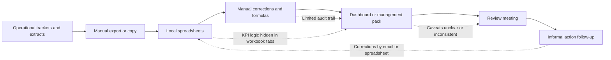

# Current State

## Purpose

This document describes a generic current-state reporting environment for the decision-support architecture playbook. It does not describe a real organisation. It is a realistic pattern that many teams experience when reporting has grown around manual routines, spreadsheets, and informal ownership.

## Current-state summary

The current state is a fragmented reporting process where data moves from operational trackers into spreadsheets, manual adjustments, dashboards, and review packs without a fully controlled route.

The reporting output exists, but confidence is uneven because the supporting architecture is weak:

- source data is not clearly mapped to report outputs;
- spreadsheets are used as transformation and correction layers;
- KPI definitions vary between reports or review forums;
- data-quality issues are tracked informally;
- ownership is unclear across source data, definitions, reporting, and action follow-up;
- review rhythm depends on meeting habits rather than a designed operating model;
- dashboard users are unsure which figures are final, provisional, or caveated.

## Current-state flow

See `diagrams/current-state-flow.mmd` for the standalone diagram file.

## Fragmented spreadsheets

Spreadsheets are used for several different purposes at once:

- source extracts are copied into local files;
- formulas clean or reshape the data;
- manual corrections are added before reporting;
- exceptions are highlighted in tabs or comments;
- KPI summaries are prepared for review packs.

This creates a practical short-term reporting route, but it also makes the process difficult to test, repeat, hand over, or explain.

## Unclear ownership

Ownership is often split across several roles without being written down:

| Area | Current-state issue |
| --- | --- |
| Source data | The team that maintains the operational tracker may not own reporting quality. |
| KPI definition | Definitions may be agreed verbally or copied from old packs. |
| Report build | One analyst may know the spreadsheet logic, but it is not documented. |
| Data corrections | Corrections may be made by whoever finds the issue first. |
| Review actions | Actions from the meeting may not be linked back to data owners. |

The absence of explicit ownership makes it harder to challenge a number, correct an issue, or maintain the report when roles change.

## Inconsistent KPI definitions

The same KPI can be calculated differently depending on the report owner or meeting:

- open work may include or exclude paused records;
- overdue work may use due date, review date, or target date;
- closed work may be counted by closure date in one pack and reporting period in another;
- high-priority work may use risk rating, priority, or escalation flag;
- data-quality exceptions may be excluded from headline reporting without a visible caveat.

This creates unnecessary debate in review forums because people spend time reconciling definitions rather than deciding what action is needed.

## Weak exception tracking

Exceptions are usually visible, but not controlled:

- missing owners are flagged manually;
- duplicate or stale records are corrected in spreadsheets;
- missing evidence is noted in comments or separate tabs;
- overdue actions are chased by email;
- high-risk unresolved items may be discussed but not logged against a clear owner.

The weakness is not that people fail to notice issues. The weakness is that issue capture, prioritisation, ownership, and closure are not part of a repeatable control loop.

## Manual reporting effort

Manual reporting effort is high because the same activities repeat each cycle:

- export data;
- clean column names and dates;
- remove obvious duplicates;
- check owners and statuses;
- update formulas;
- refresh visuals;
- copy results into a pack;
- explain changes in meetings;
- chase corrections after the meeting.

Manual work may be necessary in an early reporting process, but it becomes risky when it is not documented, tested, or gradually reduced.

## Unclear review rhythm

The review routine often exists as a meeting but not as a designed process.

Common gaps:

- no agreed cut-off date for source data;
- unclear distinction between draft and final numbers;
- no pre-review data-quality checkpoint;
- actions captured separately from the dashboard;
- no regular review of KPI definitions;
- no clear route for closing exceptions.

Without a defined rhythm, a dashboard can become a discussion aid rather than a decision-support system.

## Low dashboard trust

Dashboard trust is low when users cannot answer basic questions about the numbers:

- Where did this figure come from?
- Has this record been corrected manually?
- Is this KPI definition the same as last month?
- Are missing fields excluded or counted?
- Who owns the data issue?
- Is this output ready for formal review?

Low trust does not always mean the dashboard is wrong. It often means the architecture around the dashboard is not visible enough.

## Current-state risks

| Risk | Consequence |
| --- | --- |
| Spreadsheet logic is not documented | Hard to review, test, or hand over |
| Ownership is informal | Issues are noticed but not reliably resolved |
| KPI definitions vary | Review time is spent reconciling numbers |
| Exceptions are tracked manually | High-risk issues can remain unresolved |
| Reporting relies on individual knowledge | Process weakens when people move roles |
| Review actions are disconnected from data issues | Reporting does not consistently drive improvement |

## Current-state design conclusion

The current state is not a failure of effort. It is a failure of architecture.

People are doing the work, but the reporting route does not yet provide enough structure around definitions, ownership, controls, cadence, and handover. The target state should therefore focus on making the route from source data to decision visible, controlled, and maintainable.
