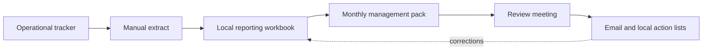

# Current State

## Flow

```mermaid
flowchart LR
    Source["Operational tracker"] --> Export["Manual extract"]
    Export --> Workbook["Local reporting workbook"]
    Workbook --> Pack["Monthly management pack"]
    Pack --> Meeting["Review meeting"]
    Meeting --> Email["Email and local action lists"]
    Email -. "corrections" .-> Workbook
```

The standalone source is the [current flow diagram](../diagrams/current-state-flow.mmd).

## Responsibilities Today

| Activity | Actual behaviour | Control weakness |
| --- | --- | --- |
| Source receipt | Analyst downloads or receives a file | Cut off, freshness and completeness are not recorded consistently |
| Data correction | Analyst edits workbook values or formulas | Correction rationale and source ownership are unclear |
| KPI calculation | Formula logic sits across workbook tabs | Definition version and approval are not recoverable |
| Quality review | Analyst checks familiar problem fields | Coverage and severity depend on individual knowledge |
| Publication | Pack is issued when preparation finishes | Technical completion is treated as readiness |
| Access | Copies are shared with meeting participants | Detail access is not enforced at the data layer |
| Decision record | Notes and actions are captured separately | Finding, decision, owner and evidence are weakly linked |
| Recovery | Prior files and analyst memory are used | Recovery time and data loss are unknown |

## Risk Concentration

The workbook is simultaneously a staging area, correction tool, calculation engine, presentation layer and partial audit record. A failure in one concern can affect the others without a clear boundary. The design also creates a key person dependency because critical interpretation lives in the preparation routine.

The current state has no measured availability, freshness, recovery, access or performance objective. That absence matters because a regular report can appear stable while depending on untested manual recovery and unrestricted copies.

## Transition Constraint

The monthly review cannot stop while the target service is introduced. The pilot therefore needs parallel reconciliation against the current pack, a defined cutover decision and a retirement plan for uncontrolled workbook logic. Parallel running must be time limited so that two competing definitions do not become permanent.
