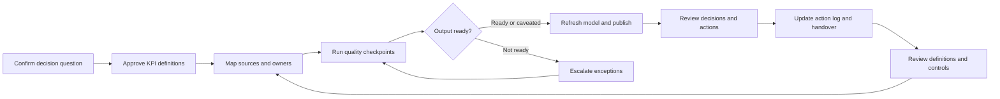

# Target State

## Purpose

This document defines the target-state architecture for a controlled decision-support reporting system. It describes a generic pattern, not a real organisation or client implementation.

The target state responds to the current-state problem: fragmented spreadsheets, unclear ownership, inconsistent KPI definitions, weak exception tracking, high manual effort, unclear review rhythm, and low dashboard trust.

## Target-state principle

The target state treats reporting as a controlled lifecycle, not a final visual.

A credible decision-support system should make the route from source data to management action visible:

1. source data is identified and owned;
2. KPI definitions are agreed and documented;
3. data quality is checked before publication;
4. reporting models are reproducible;
5. outputs show caveats and limitations;
6. review forums capture decisions and actions;
7. handover material allows another owner to maintain the process.

## Target-state architecture

## Controlled reporting lifecycle

| Stage | Target-state behaviour | Evidence to maintain |
| --- | --- | --- |
| Requirement | Reporting need is linked to a management question. | Reporting requirement note, audience, decision, cadence |
| Definition | KPI logic is documented before visuals are built. | KPI dictionary, owner, formula, caveats |
| Source mapping | Source fields are mapped to output fields. | Source-to-output map, field ownership, refresh route |
| Quality control | Completeness, ownership, timeliness, duplicate, and evidence checks run before publication. | Data-quality rule set, exception register, quality summary |
| Model build | Transformation and semantic logic are reusable and versioned where possible. | Model documentation, measures, lineage |
| Publication | Output is refreshed against agreed cut-off and caveats are visible. | Refresh record, known limitations, approval note |
| Review | Review forum uses the output to agree decisions and actions. | Meeting record, decisions, action owners, due dates |
| Follow-up | Actions and data corrections feed back into the next cycle. | Action log, closure evidence, updated rules |
| Handover | Process can be maintained without relying on one person. | Handover pack, runbook, owner list, failure points |

## Ownership model

| Ownership area | Accountable role | Responsibility |
| --- | --- | --- |
| Source data | Data owner | Maintains source data quality and confirms field meaning |
| KPI definition | KPI owner | Approves KPI formula, inclusion rules, caveats, and review cadence |
| Data quality controls | Reporting assurance owner | Defines checks, reviews exceptions, confirms readiness for reporting |
| Reporting model | Analytics or BI owner | Maintains transformations, semantic model, measures, and refresh route |
| Management output | Report owner | Publishes the output, explains caveats, and coordinates review |
| Review forum | Decision owner | Uses the output to agree actions and priorities |
| Action follow-up | Action owner | Completes agreed actions and provides closure evidence |
| Handover | Service owner | Ensures documentation and operating knowledge are maintained |

## Quality checkpoints

The target state should include quality checkpoints before management outputs are used:

- source file or table received;
- required fields present;
- owner and category fields populated;
- status values match agreed definitions;
- duplicate records checked;
- stale records identified;
- closed records have evidence where required;
- high-risk overdue items have an action owner;
- target coverage is visible for KPI reporting;
- exceptions are logged with owner, severity, and recommended action.

Quality checks do not need to block every report. They should make readiness visible and provide a clear route for escalation when risk is high.

## Escalation path

The target state should include a simple escalation path:

| Condition | Escalation route |
| --- | --- |
| Missing source extract | Report owner contacts source data owner before publication |
| KPI definition dispute | KPI owner resolves definition before the next formal pack |
| High-severity data quality issue | Reporting assurance owner logs exception and alerts decision owner |
| High-risk overdue item without owner | Decision owner assigns an action owner in review forum |
| Repeated manual correction | Analytics or BI owner reviews whether the correction should become a controlled transformation |
| Dashboard trust issue | Report owner records the issue, updates caveats, and triggers review of source-to-output map |

## Review rhythm

The target review rhythm should be explicit:

| Timing | Activity |
| --- | --- |
| Before reporting cycle | Confirm requirements, cut-off date, source availability, and definition changes |
| During preparation | Run quality checks, refresh model, review exceptions, prepare caveats |
| Before publication | Confirm high-severity exceptions and known limitations |
| Management review | Review KPIs, exceptions, decisions, actions, owners, and due dates |
| After review | Update action log, close agreed corrections, refine controls if needed |
| Periodic governance | Review KPI dictionary, ownership model, quality rules, and handover pack |

## Handover structure

The target state should maintain a handover pack that includes:

- reporting purpose and audience;
- source-to-output map;
- source owners and report owners;
- KPI dictionary;
- data-quality rule catalogue;
- refresh steps and cut-off assumptions;
- known failure points;
- exception and escalation process;
- review rhythm;
- action log structure;
- limitations and caveats;
- change history.

## Target-state outcome

The target state should reduce reliance on individual memory and manual interpretation. A reviewer should be able to understand:

- where the data came from;
- what each KPI means;
- what was checked before publication;
- which issues remain unresolved;
- who owns follow-up;
- how the process is handed over.

This does not require a large platform before value can be created. It requires clear architecture, ownership, controls, and review discipline.
