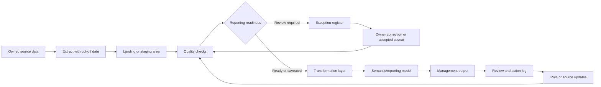

# Source-to-Output Map

## Purpose

The source-to-output map explains how data moves from an operational source to a management decision. It makes lineage, ownership, quality controls, and reporting outputs visible.

This document is generic and does not describe a real organisation. It defines the structure that a real implementation would complete during discovery.

## Target source-to-output flow

The same diagram is maintained as `diagrams/source-to-output-flow.mmd`.

## Mapping structure

| Layer | Purpose | Owner | Control point | Output |
| --- | --- | --- | --- | --- |
| Source data | Operational record of activity, status, owner, date, risk, or evidence | Data owner | Source fields and update cadence confirmed | Agreed source extract or table |
| Extraction route | Repeatable route for getting data into reporting process | Analytics or BI owner | Cut-off date and extraction method recorded | Raw reporting input |
| Landing or staging | Preserve source shape before transformation | Analytics or BI owner | Row counts, required columns, file/table receipt | Staged input |
| Quality checks | Identify reporting-readiness issues before publication | Reporting assurance owner | Completeness, ownership, duplicate, status, freshness, evidence checks | Exception register and quality summary |
| Transformation layer | Apply agreed business rules and model structure | Analytics or BI owner | Versioned logic and documented assumptions | Reporting-ready model |
| Semantic/reporting model | Define metrics, relationships, filters, and measures | BI or semantic model owner | KPI dictionary and measure review | Reusable reporting model |
| Management output | Present KPIs, exceptions, and caveats for review | Report owner | Refresh confirmation and caveat review | Dashboard, report pack, or scorecard |
| Review and action log | Convert outputs into owned decisions and actions | Decision owner | Action owner and due date assigned | Decision record and action log |
| Corrections and rule updates | Feed lessons back into source and controls | Data owner and reporting assurance owner | Corrections closed with evidence | Updated source data, rules, or definitions |

## Minimum source-to-output fields

A practical source-to-output map should capture:

| Field | Meaning |
| --- | --- |
| Source name | Generic source, tracker, table, or extract label |
| Source owner | Role accountable for source quality and meaning |
| Source grain | What one row represents |
| Key fields | Fields required for reporting and joins |
| KPI dependency | Which KPI or output depends on the source |
| Quality checks | Checks applied before reporting |
| Transformation rule | Business rule applied after extraction |
| Output field | Field or measure shown to users |
| Report owner | Role accountable for publication |
| Caveat | Known interpretation limit |
| Escalation route | Where issues go if the source or output is not ready |

## Example generic mapping

| Source field | Meaning | Control | Output use |
| --- | --- | --- | --- |
| `record_id` | Unique operational record | Required and unique | Drill-through and exception tracking |
| `owner_role` | Role accountable for the record | Required for active records | Ownership and follow-up |
| `status` | Current lifecycle state | Accepted values check | Open, closed, paused, overdue metrics |
| `risk_rating` | Priority or risk level | Accepted values check | Escalation and prioritisation |
| `due_date` | Expected action or completion date | Required where target applies | Overdue and due-soon reporting |
| `closure_evidence` | Evidence for closed record | Required for closed records where applicable | Assurance and readiness warnings |
| `last_reviewed_date` | Latest review date | Freshness check | Stale-record control |

## Design rules

- Every management output should trace back to a source field or documented measure.
- Manual adjustments should be visible, owned, and time-bound.
- KPI logic should sit in the transformation or semantic layer, not in meeting slides.
- Quality checks should run before publication, not after questions are raised.
- Exceptions should have owner, severity, due date, recommended action, and closure evidence.
- Caveats should be visible in the output when they affect interpretation.

## Source-to-output acceptance criteria

The map is good enough for decision support when a reviewer can answer:

- What source feeds this KPI?
- Who owns the source data?
- What checks ran before publication?
- Which records were excluded or caveated?
- Where is the calculation defined?
- Who owns correction if the number is wrong?
- How does the issue feed back into the next reporting cycle?
