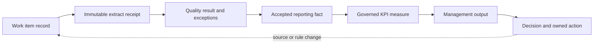

# Source To Output Map

## Lineage

The service keeps the operational record, received extract, accepted reporting data, governed measures and management output as distinct objects. This prevents an analyst correction from becoming an undocumented source fact.

```mermaid
flowchart LR
    Source["Work item record"] --> Receipt["Immutable extract receipt"]
    Receipt --> Result["Quality result and exceptions"]
    Result --> Fact["Accepted reporting fact"]
    Fact --> Measure["Governed KPI measure"]
    Measure --> Output["Management output"]
    Output --> Decision["Decision and owned action"]
    Decision -. "source or rule change" .-> Source
```

## Interface Register

| ID | From | To | Contract | Main protection |
| --- | --- | --- | --- | --- |
| `INT-01` | Operational Work System | Landing Store | Daily CSV extract | Service identity, encrypted transport, immutable receipt |
| `INT-02` | Landing Store | Quality Gate | Verified batch read | Read only identity and checksum verification |
| `INT-03` | Quality Gate | Reporting Mart | Accepted relational records | Separate writer identity and atomic publication |
| `INT-04` | Reporting Mart | Semantic Model | Daily tabular refresh | Read only identity and refresh audit |
| `INT-05` | Semantic Model | Management Report | Interactive governed query | User identity and service area filtering |
| `INT-06` | Management Report | Action Register | Controlled review record | Named user and version history |
| `INT-07` | Identity Provider | Semantic Model | Identity and group claim | Managed identity integration |
| `INT-08` | Quality Gate | Evidence Store | Structured quality evidence | Append only write and retention policy |
| `INT-09` | Management Report | Evidence Store | Publication evidence | Approval and report version metadata |
| `INT-10` | Landing Store | Observability Service | Receipt health event | Restricted metadata without source records |
| `INT-11` | Quality Gate | Observability Service | Quality health event | Status without exception records |
| `INT-12` | Reporting Mart | Observability Service | Load health event | Status and reconciliation counts |
| `INT-13` | Semantic Model | Observability Service | Refresh health event | Refresh, access and performance status |
| `INT-14` | Management Report | Observability Service | Availability event | Availability and publication metadata |

The catalogue is authoritative for interface direction, mode, format, cadence and protection. The [container view](../diagrams/container-view.mmd) uses the same identifiers so a reviewer can move between table and diagram without translating names.

## Source Contract

The pilot source contract must record:

- source owner and authoritative system;
- one row per work item and the stable item key;
- approved field names, types, null rules and reference values;
- daily delivery window and reporting cut off;
- timezone and date interpretation;
- correction and replay behaviour;
- excluded sensitive fields;
- schema change notice period and escalation route.

The Landing Store records the original object checksum, source timestamp, receipt timestamp, contract version and ingestion identity. A correction creates a new receipt; it does not overwrite the evidence for the rejected run.

## Boundary Reconciliation

| Boundary | Reconciliation |
| --- | --- |
| Source to landing | File count, byte count, checksum and source timestamp |
| Landing to quality | Input row count and distinct work item count |
| Quality to mart | Accepted, rejected and exception counts reconcile to input |
| Mart to semantic model | Fact and dimension counts plus orphan key checks |
| Semantic model to report | Headline measures reconcile to an independent accepted result set |
| Report to action register | Every material finding has a decision or an owned action |

## Change Rules

A new field that does not affect grain or semantics can follow the source contract change route. A change to grain, key, KPI meaning, access scope, retention or interface ownership is architecturally significant and needs an ADR or a record that supersedes an existing ADR.

The design does not permit report calculations to compensate silently for an unknown source definition. The source owner must resolve meaning before the KPI owner approves use.

## Acceptance

The source to output route is acceptable when one synthetic cycle can be replayed from receipt through publication, all boundary counts reconcile, a rejected run cannot update the mart and each published KPI links to its approved definition and source fields.
