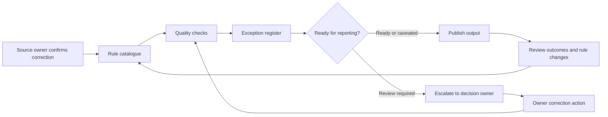

# Data Quality Controls

## Purpose

This document defines the target-state data quality controls for a controlled decision-support reporting process. The controls are generic and should be adapted during real discovery.

The intent is to make data readiness visible before reporting outputs are used in management review.

## Control principles

- Controls should run before publication.
- Checks should be tied to business meaning, not only technical validity.
- Exceptions should have severity, owner, recommended action, and closure route.
- Not every exception should block reporting, but high-risk issues should be visible and escalated.
- Control results should feed into the next review cycle.

## Quality checkpoint model

## Target control catalogue

| Control area | Example check | Business meaning | Severity guide | Recommended action |
| --- | --- | --- | --- | --- |
| Completeness | Required fields are populated | Records cannot support reporting if key fields are blank | High where KPI depends on field | Assign correction to source owner |
| Ownership | Active records have an owner | Follow-up cannot happen without accountability | High for overdue or high-risk records | Add owner or escalate to decision owner |
| Duplicate records | Record identifiers are unique | Duplicates can inflate workload or exception counts | Medium to high depending on output | De-duplicate or confirm valid repeat records |
| Accepted values | Status, risk, and priority use agreed values | Invalid values break KPI logic and filters | Medium | Correct values or update reference list |
| Freshness | Records have been reviewed within expected cycle | Stale records can misstate current position | Medium | Review record or mark as stale caveat |
| Evidence completeness | Closed records have required evidence | Closed performance may not be defensible | Medium to high | Attach evidence or reopen review |
| Target coverage | Records needing target assessment have target mapping | SLA or target rates are not reliable without coverage | Medium | Add target rule or exclude with caveat |
| Overdue action | Overdue high-risk records have action owner and due date | Review needs visible follow-up | High | Escalate to decision owner |
| Manual adjustment | Manual corrections are logged and approved | Uncontrolled changes weaken trust | Medium | Move repeat correction into controlled rule |

## Exception register fields

A target-state exception register should include:

| Field | Purpose |
| --- | --- |
| Exception ID | Stable identifier for the issue |
| Record ID | Source record affected |
| Rule ID | Control rule that triggered the exception |
| Severity | High, medium, or low |
| Field | Field affected |
| Issue | Plain-language problem |
| Recommended action | Correction or review needed |
| Data owner | Role responsible for source correction |
| Action owner | Role responsible for follow-up |
| Due date | Expected correction date |
| Status | Open, in progress, accepted risk, closed |
| Closure evidence | Evidence that issue was resolved |

## Escalation path

| Trigger | Escalation |
| --- | --- |
| High-severity exception affects headline KPI | Report owner flags caveat before publication and informs decision owner |
| High-risk overdue record has no owner | Decision owner assigns action owner during review |
| Same quality issue repeats across cycles | Reporting assurance owner reviews root cause with data owner |
| Manual correction recurs | Analytics or BI owner converts correction into documented transformation rule |
| Target coverage falls below agreed threshold | KPI owner reviews target dictionary before formal reporting |

## Reporting readiness states

| State | Meaning | Reporting action |
| --- | --- | --- |
| Ready | No high-severity exceptions affecting headline outputs | Publish normally |
| Ready with caveats | Known issues exist but do not invalidate the output | Publish with visible caveats |
| Review required | High-severity issues affect interpretation | Hold or escalate before formal use |
| Not ready | Source or controls are incomplete | Do not use for formal decision support |

## Review rhythm for controls

| Timing | Control activity |
| --- | --- |
| Before refresh | Confirm source availability and cut-off date |
| During preparation | Run quality checks and generate exceptions |
| Before publication | Review high-severity exceptions and caveats |
| Management review | Agree actions for unresolved exceptions |
| After review | Close actions, update rules, and document changes |
| Periodic governance | Review rule effectiveness and ownership |

## Handover requirements

Data quality controls should be included in the handover pack:

- rule catalogue;
- rule owners;
- exception register structure;
- escalation route;
- readiness-state definitions;
- known recurring issues;
- instructions for changing a rule;
- evidence required for closing exceptions.

## Limitations

- These controls are generic and do not replace source-specific profiling.
- Severity should be calibrated to the reporting context.
- Some issues may be accepted as caveats rather than corrected immediately.
- Automated checks still need human ownership and review.
