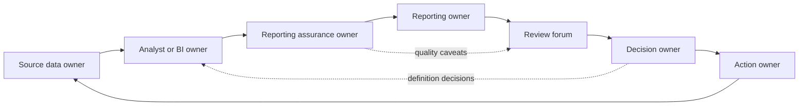

# Operating Model

## Purpose

The operating model explains how people maintain and use the reporting architecture after the first report or dashboard is built.

A controlled decision-support system needs more than a source-to-output map. It needs clear ownership, review cadence, quality responsibilities, escalation routes, change control, and handover material. Without those elements, reporting can depend on one analyst, one spreadsheet, or one informal meeting routine.

This document defines a practical operating model for a generic reporting process using safe, non-client context.

## Operating Model Principles

- Every source, KPI, control, output, and action should have an owner.
- The review rhythm should be written down before the report is relied on.
- Data-quality issues should be logged, prioritised, assigned, and closed with evidence.
- KPI and report changes should be approved rather than made silently.
- Handover material should allow another person to run or review the process.
- The reporting process should make caveats visible instead of hiding uncertainty.

## Core Roles

| Role | Main responsibility | Typical evidence maintained |
| --- | --- | --- |
| Source data owner | Maintains source fields, confirms field meaning, and corrects source issues | Source owner list, correction log, field definitions |
| KPI definition owner | Approves calculation logic, inclusion rules, exclusions, targets, and caveats | KPI dictionary and change record |
| Reporting owner | Coordinates the reporting cycle and publishes the output | Refresh note, caveat log, publication checklist |
| Analytics or BI owner | Maintains transformations, semantic model logic, DAX/SQL, and model documentation | Model documentation, versioned logic, test results |
| Reporting assurance owner | Defines quality checks and reviews exception severity before publication | Rule catalogue, exception register, readiness summary |
| Review forum owner | Runs the management review and confirms decisions, actions, and escalations | Agenda, decision record, action log |
| Action owner | Completes an agreed follow-up action and provides closure evidence | Action update, due date, closure evidence |
| Handover owner | Keeps operating documentation current and confirms coverage during role changes | Handover pack, owner rota, known failure points |

In a small team, one person may cover several roles. The important point is that the responsibilities are explicit.

## Reporting Ownership Model

Ownership should be assigned at four levels.

| Ownership level | What is owned | Why it matters |
| --- | --- | --- |
| Source ownership | Source extract, tracker, table, fields, update timing | Prevents unclear correction routes when data is wrong or late |
| Definition ownership | KPI meaning, filters, targets, caveats, approved changes | Prevents the same KPI being calculated differently across reports |
| Build ownership | Transformation logic, semantic model, report structure, refresh path | Prevents hidden logic and unsupported manual changes |
| Decision ownership | Review decisions, priorities, escalations, action closure | Prevents dashboards becoming passive status reports |

The owner list should include role names rather than depending only on named individuals. Named contacts can be added for the current cycle, but the architecture should survive role changes.

## Review Cadence

The review cadence should separate preparation, publication, decision review, and follow-up.

| Timing | Activity | Owner | Output |
| --- | --- | --- | --- |
| Before cycle starts | Confirm reporting period, source cut-off, known definition changes, and required outputs | Reporting owner | Cycle checklist |
| Source receipt | Confirm source extracts have arrived and match expected structure | Source data owner and reporting owner | Source receipt note |
| Preparation | Run quality checks, refresh models, review exceptions, and prepare caveats | Analytics or BI owner and reporting assurance owner | Exception register and readiness summary |
| Pre-publication | Confirm high-severity issues, caveats, and any hold decisions | Reporting owner and decision owner | Publication approval or escalation note |
| Review meeting | Discuss KPI movement, exceptions, decisions, actions, owners, and due dates | Review forum owner | Decision and action log |
| After review | Update action status, correct source data, close exceptions, and record changes | Action owners and source data owners | Updated action log and closure evidence |
| Periodic governance | Review KPI dictionary, quality rules, owner list, and handover pack | KPI owner, assurance owner, reporting owner | Updated governance record |

## Data Quality Responsibilities

Data quality should be treated as a shared control, not a task left to the report builder.

| Quality activity | Responsible role | Review point |
| --- | --- | --- |
| Confirm required source fields | Source data owner | Before the reporting cycle |
| Maintain quality rule catalogue | Reporting assurance owner | Periodic governance review |
| Run quality checks | Analytics or BI owner | During preparation |
| Review high-severity exceptions | Reporting assurance owner | Before publication |
| Correct source data | Source data owner | After issue assignment |
| Decide whether to publish with caveats | Decision owner and reporting owner | Pre-publication |
| Close exceptions with evidence | Action owner or source data owner | After review |
| Review repeated failure patterns | Reporting assurance owner and source data owner | Periodic governance review |

Quality checks should not automatically block every output. The operating model should distinguish between:

- issues that prevent publication;
- issues that allow publication with a visible caveat;
- issues that can be corrected after review;
- issues that require a definition or source-process change.

## Escalation Route

The escalation route should be short enough to use in a real reporting cycle.

| Trigger | Escalation owner | Expected response |
| --- | --- | --- |
| Source extract missing or late | Reporting owner | Confirm revised timing or report caveat |
| Required field missing from source | Source data owner | Correct source or approve temporary caveat |
| KPI definition disputed | KPI definition owner | Confirm approved logic before next formal pack |
| High-severity exception affects headline KPI | Reporting assurance owner and decision owner | Decide whether to hold, caveat, or publish |
| High-risk item has no action owner | Review forum owner | Assign owner during review |
| Repeated manual correction | Analytics or BI owner | Convert correction into documented transformation or source fix |
| Report user challenges the number | Reporting owner | Trace source, definition, control result, and caveat |
| Change would break trend comparison | KPI definition owner | Approve effective date and restatement approach |

Escalations should be logged with owner, date raised, decision, action, due date, and closure evidence.

## Change Control

KPI, source, and report changes should be visible because they can change interpretation.

### Changes Requiring Approval

- KPI formula changes.
- Inclusion or exclusion rule changes.
- New target thresholds.
- Source field replacement or removal.
- Transformation logic that changes historic results.
- New report page or retired report page.
- Change to refresh cadence or reporting cut-off.
- Material caveat added or removed.

### Change Record

Each approved change should capture:

| Field | Purpose |
| --- | --- |
| Change ID | Stable reference for audit and handover |
| Requested by | Role or forum requesting the change |
| Change type | KPI, source, model, report, quality rule, cadence, or handover |
| Description | Plain-language change |
| Reason | Why the change is needed |
| Impact | Measures, reports, users, and historic periods affected |
| Approval owner | Role accountable for accepting the change |
| Implementation owner | Role accountable for making the change |
| Effective date | Reporting period from which the change applies |
| Restatement decision | Whether historic results are recalculated, marked as not comparable, or left unchanged |
| Evidence | Link or note confirming the change was implemented and reviewed |

Changes do not need a heavy process, but they do need a trail that a reviewer can follow.

## Analyst, Owner, Reviewer, and Decision-Maker Interaction

The operating model should make the hand-offs clear.

Expected interaction pattern:

1. Source data owner confirms data and resolves source issues.
2. Analyst or BI owner prepares model/output and runs checks.
3. Reporting assurance owner reviews exceptions and readiness.
4. Reporting owner publishes the pack with visible caveats.
5. Review forum uses the output to agree decisions and actions.
6. Decision owner resolves priority and definition disputes.
7. Action owners close follow-up actions with evidence.
8. Lessons feed back into source quality, rules, definitions, or model logic.

## Handover Model

The handover model should reduce dependence on individual memory.

Minimum handover pack:

- reporting purpose and audience;
- owner list and deputies;
- source-to-output map;
- KPI dictionary;
- data-quality rule catalogue;
- refresh and publication checklist;
- exception register structure;
- escalation route;
- change-control log;
- review cadence and forum details;
- known failure points;
- open actions and unresolved caveats;
- recent definition changes;
- file locations or repository structure;
- instructions for updating diagrams and templates.

Handover should be reviewed when:

- the reporting owner changes;
- a source system or extract changes;
- KPI logic changes materially;
- the reporting cycle moves from prototype to routine use;
- a repeated issue shows that current documentation is insufficient.

## Operating Model Acceptance Criteria

The operating model is ready when a reviewer can answer:

- Who owns the source data?
- Who owns each KPI definition?
- Who runs and reviews data-quality checks?
- What happens if the data is not ready?
- Who approves a KPI or report change?
- How are decisions and actions captured?
- How is closure evidenced?
- Could someone else run or review the process from the handover pack?
