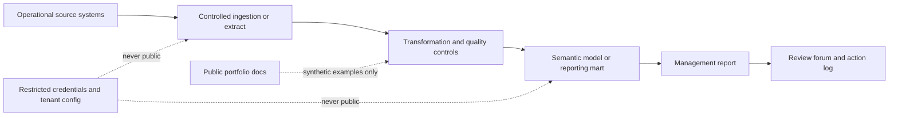

# Security Architecture

## Purpose

This document defines the security architecture considerations for a controlled
decision support reporting process. It is generic and synthetic. It does not
describe a real client, employer, platform, network, or protected environment.

Reporting architecture must cover classification, access, auditability, and
public and private boundaries. A data flow diagram is not enough.

## Security Principles

- Classify data before it enters the reporting route.
- Keep least privilege access aligned to business roles.
- Separate source ownership, transformation ownership, reporting ownership, and decision ownership.
- Make sensitive data exclusions explicit before publication.
- Log manual changes, publication approvals, and accepted caveats.
- Avoid copying protected data into unmanaged spreadsheets or public repositories.
- Treat diagrams and operating model documents as potentially sensitive.

## Information Classification

| Classification | Example in reporting context | Handling expectation |
| --- | --- | --- |
| Public | Generic portfolio templates and synthetic examples | Safe for public GitHub after review |
| Internal | Operating cadence, generic process ownership, non sensitive reporting notes | Keep inside organisation repositories or workspaces |
| Confidential | Client names, detailed performance issues, named action owners, sensitive metrics | Restrict access, redact in review packs, avoid public screenshots |
| Restricted | Credentials, tenant IDs, security gaps, privileged access maps, protected operational details | Never place in public docs; use approved secure systems only |

## Security Boundary Diagram

The target architecture should distinguish between public portfolio material,
controlled reporting assets, and restricted operational data.

## Control Placement

| Control point | Security purpose | Evidence to maintain |
| --- | --- | --- |
| Source access approval | Confirm who can extract or view source data | Access owner and approval record |
| Data classification | Confirm fields are safe for intended audience | Classification note and redaction rules |
| Transformation access | Limit who can alter business logic | Repository permissions and change records |
| Quality exception review | Prevent misleading publication | Exception register and caveat decision |
| Semantic model access | Enforce role based visibility | RLS and access model plus test evidence |
| Publication approval | Confirm pack is safe and caveated | Publication checklist |
| Handover | Avoid undocumented privileged access | Owner list, deputies, and secure credential route |

## Defence and Regulated Environment Considerations

For secure or regulated environments, the architecture should also consider:

- offline or controlled network operation;
- approved artifact promotion between environments;
- no long lived credentials in source code;
- separation of development, test, and production workspaces;
- audit logging for refresh, publication, access changes, and definition changes;
- redaction of sensitive operational details from executive outputs;
- retention and disposal rules for extracts and generated packs;
- named accountable owners for access review and exception acceptance.

## Public Repository Boundary

This repo may include:

- generic security architecture patterns;
- synthetic diagrams;
- template checklists;
- public safe control language.

This repo must not include:

- real system names;
- internal URLs;
- tenant IDs;
- security group names;
- customer or employer data;
- live access control exports;
- incident details from a real organisation.

## Acceptance Criteria

The security architecture is ready for review when a reader can answer:

- What data classification applies before publication?
- Which roles can view or alter the reporting route?
- Where are credentials and tenant settings excluded?
- Which controls prevent misleading or unsafe publication?
- How are access, caveats, and change approvals evidenced?
- What extra controls apply in secure or regulated environments?
